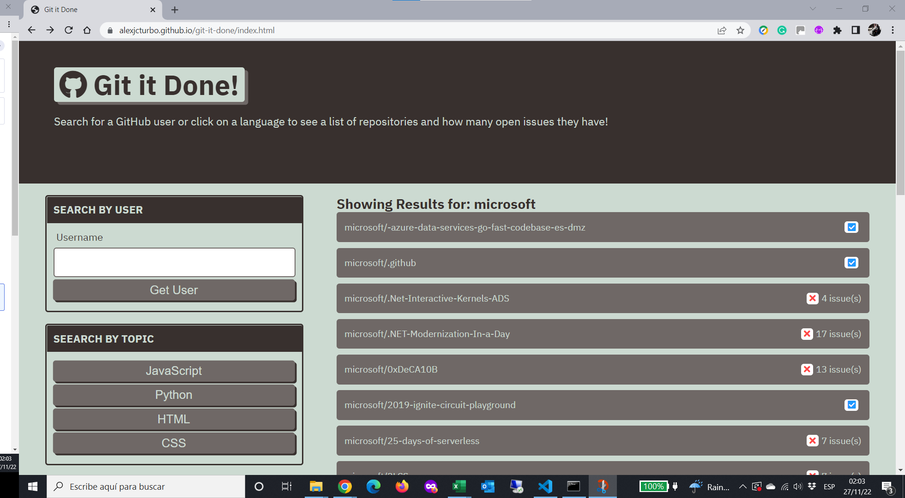
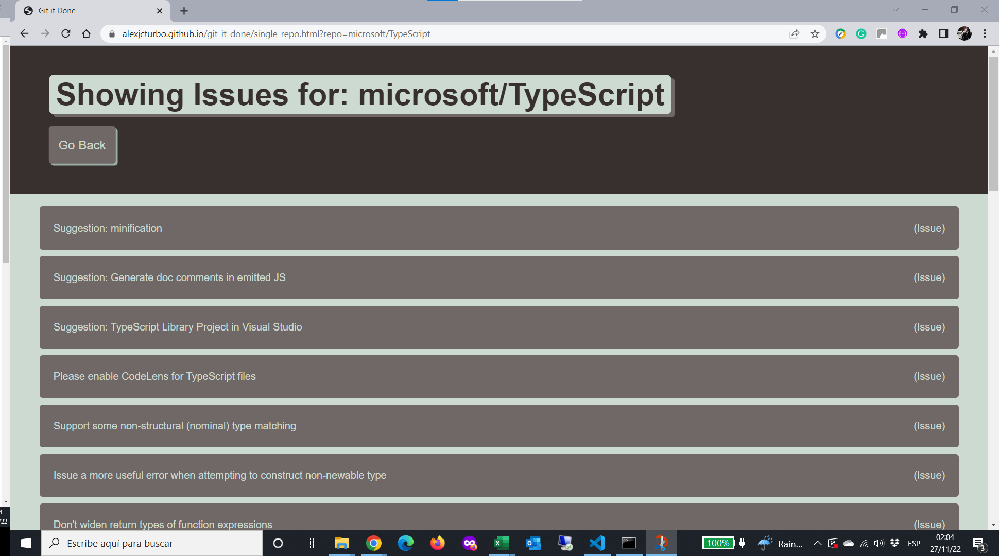

# Git-It-Done

## Table of Contents
- [Project Description](#Project-Description)
- [User Story](#User-Story)
- [Screen Captures](#Screen-Captures)
- [Technologies](#Technologies)
- [Links](#Links)

## Project Description
Git-It-Done is a web app that uses GitHub's API to search for open-source projects with open issues and pull requests.

The project consists in adding the logic to retrieve and display GitHub repositories and their open issue counts when a user searches for them.

The user can search for repositories by username or by selecting the programming language of preference. The user can then click on a specific repo and the associated issues will be displayed. When clicking on a specific issue, a new tab will open the GitHub page of the issue.
###### [Back to Index](#Table-of-Contents)

## User Story
```
AS AN web developer that wants to contribute to open-source projects
I WANT to create an application that allows me to search for GitHub repos
SO THAT I can find open issues from specific languages and contribute to open-source projects
```
###### [Back to Index](#Table-of-Contents)


## Screen Captures




###### [Back to Index](#Table-of-Contents)


## Technologies

###### [Back to Index](#Table-of-Contents)

## Links
- [Deployed Application](https://alexjcturbo.github.io/git-it-done/)
###### [Back to Index](#Table-of-Contents)